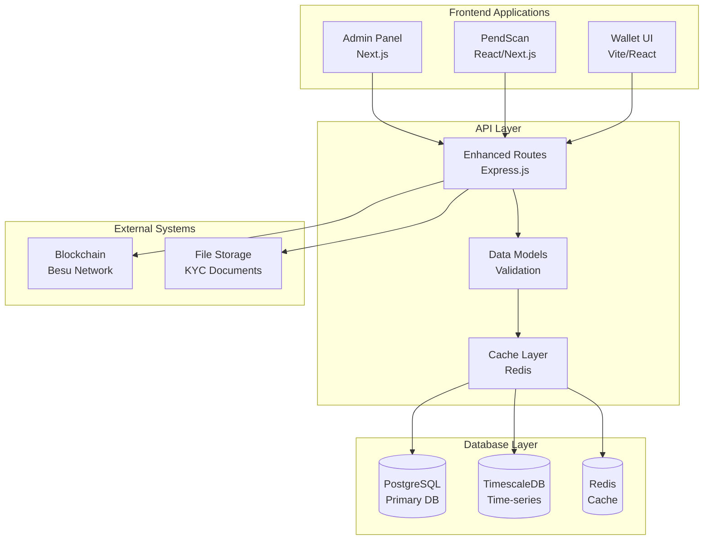

# Database Architecture - PostgreSQL Migration

## 🏗️ **Architecture Overview**

Migration from JSON file-based storage to a robust PostgreSQL database system with Redis caching, designed to support the Next.js admin panel, enhanced PendScan, and existing server infrastructure.

## 📊 **Current State Analysis**

### **Existing Data Storage**
```typescript
// Current JSON File Structure (server/)
├── wallet-db.json              # User wallet mappings (35 wallets)
├── admin-opportunities.json    # Asset opportunities (3 items)
├── admin-logs.json             # Admin action logs (< 10 entries)
├── uploads/kyc/metadata.json   # KYC document metadata
└── explorer-data/              # Live blockchain data
    ├── data-backup.json        # Blockchain analytics backup
    ├── enhanced-historical-data.json  # Historical blockchain data
    ├── live-stats.json         # Real-time network statistics
    ├── persistent-transactions.json   # Transaction history
    ├── transactions-log.json   # Transaction processing log
    └── wallets-directory.json  # Complete wallet directory
```

### **Current Data Volumes & Growth**
```typescript
// Production Data Scale (December 2024)
Current State: {
  users: 139,
  transactions: "Thousands",
  blocks: 74000,
  assets: 8,
  kycApplications: "Dozens",
  adminLogs: "Hundreds"
}

Projected Growth (Q2 2025): {
  users: 1000,
  transactions: "Tens of thousands",
  blocks: 200000,
  assets: 50,
  kycApplications: "Hundreds",
  adminLogs: "Thousands"
}
```

### **Current Limitations**
- **No ACID Transactions**: Risk of data corruption during concurrent operations
- **No Referential Integrity**: Manual relationship management between entities
- **Limited Query Capabilities**: No complex filtering, sorting, or aggregations
- **No Backup/Recovery**: File-based storage without automated backup
- **Performance Issues**: File I/O becomes bottleneck with scale
- **No Analytics**: Limited ability to generate insights from data

## 🚀 **Target Database Architecture**

### **Multi-Tier Database Strategy**

```typescript
// Database Tier Architecture
┌─────────────────────────────────────────────────────────────┐
│                    Application Layer                        │
├─────────────────┬─────────────────┬─────────────────────────┤
│   Admin Panel   │     Server      │      PendScan           │
│   (Next.js)     │   (Node.js)     │    (React/Next.js)      │
└─────────────────┴─────────────────┴─────────────────────────┘
                           │
┌─────────────────────────────────────────────────────────────┐
│                     API Gateway Layer                       │
│           (Enhanced server routes with validation)          │
└─────────────────────────────────────────────────────────────┘
                           │
┌─────────────────┬─────────────────┬─────────────────────────┐
│  PostgreSQL     │     Redis       │    TimescaleDB          │
│  (Primary DB)   │   (Cache)       │   (Time-series)         │
│                 │                 │                         │
│ • Users         │ • Sessions      │ • Block data            │
│ • Assets        │ • API cache     │ • Transactions          │
│ • KYC data      │ • Real-time     │ • Analytics events      │
│ • Admin logs    │   metrics       │ • Performance metrics   │
└─────────────────┴─────────────────┴─────────────────────────┘
```

### **Database Technology Stack**

#### **Primary Database: PostgreSQL 15+**
```sql
-- Core Features Utilized
- JSONB for flexible document storage
- Full-text search capabilities
- Advanced indexing (B-tree, GIN, GiST)
- Row-level security for data isolation
- Materialized views for analytics
- Triggers for audit trails
- Foreign key constraints for data integrity
```

#### **Caching Layer: Redis 7+**
```typescript
// Redis Usage Patterns
Cache Categories: {
  sessions: "24 hours TTL",
  apiResponses: "5-30 minutes TTL", 
  blockchainData: "30 seconds TTL",
  userProfiles: "1 hour TTL",
  assetMetrics: "10 minutes TTL"
}

// Redis Data Structures
- Strings: Simple key-value caching
- Hashes: User session data
- Sets: Active user tracking
- Sorted Sets: Leaderboards, rankings
- Lists: Real-time event streams
```

#### **Time-Series Database: TimescaleDB**
```sql
-- Blockchain & Analytics Data
CREATE TABLE blockchain_metrics (
  time TIMESTAMPTZ NOT NULL,
  block_number BIGINT,
  transaction_count INTEGER,
  gas_used BIGINT,
  network_hash_rate BIGINT
);

SELECT create_hypertable('blockchain_metrics', 'time');

-- Analytics Events
CREATE TABLE analytics_events (
  time TIMESTAMPTZ NOT NULL,
  event_type VARCHAR(50),
  user_id UUID,
  event_data JSONB,
  session_id VARCHAR(100)
);

SELECT create_hypertable('analytics_events', 'time');
```

## 🗄️ **Database Schema Design**

### **Core Entity Relationships**

```sql
-- Users & Identity Management
CREATE TABLE users (
  id UUID PRIMARY KEY DEFAULT gen_random_uuid(),
  phone_hash VARCHAR(64) UNIQUE NOT NULL,
  blockchain_address VARCHAR(42) UNIQUE NOT NULL,
  tier INTEGER DEFAULT 0 CHECK (tier >= 0 AND tier <= 5),
  status VARCHAR(20) DEFAULT 'active' CHECK (status IN ('active', 'suspended', 'closed')),
  created_at TIMESTAMPTZ DEFAULT NOW(),
  updated_at TIMESTAMPTZ DEFAULT NOW()
);

CREATE TABLE user_profiles (
  user_id UUID PRIMARY KEY REFERENCES users(id) ON DELETE CASCADE,
  phone_number_masked VARCHAR(20), -- Format: +20***7890
  country_code VARCHAR(3),
  registration_ip INET,
  last_login_at TIMESTAMPTZ,
  login_count INTEGER DEFAULT 0,
  device_fingerprints JSONB DEFAULT '[]',
  preferences JSONB DEFAULT '{}',
  metadata JSONB DEFAULT '{}'
);

-- Asset & Investment Management
CREATE TABLE assets (
  id UUID PRIMARY KEY DEFAULT gen_random_uuid(),
  contract_address VARCHAR(42) UNIQUE NOT NULL,
  type VARCHAR(20) NOT NULL CHECK (type IN ('investment', 'interest')),
  title VARCHAR(255) NOT NULL,
  description TEXT,
  category VARCHAR(50),
  location VARCHAR(255),
  image_url VARCHAR(500),
  status VARCHAR(20) DEFAULT 'active' CHECK (status IN ('active', 'paused', 'closed', 'draft')),
  metadata JSONB DEFAULT '{}',
  created_by UUID REFERENCES users(id),
  created_at TIMESTAMPTZ DEFAULT NOW(),
  updated_at TIMESTAMPTZ DEFAULT NOW()
);

CREATE TABLE asset_details (
  asset_id UUID PRIMARY KEY REFERENCES assets(id) ON DELETE CASCADE,
  -- Investment-specific fields
  token_symbol VARCHAR(10),
  token_price DECIMAL(18,6),
  max_supply BIGINT,
  expected_roi DECIMAL(5,2),
  lockup_period INTEGER, -- days
  minimum_investment DECIMAL(18,6),
  -- Interest-only specific fields
  soft_cap DECIMAL(18,6),
  deadline TIMESTAMPTZ,
  contact_format VARCHAR(20) CHECK (contact_format IN ('whatsapp', 'email')),
  contact_value VARCHAR(255),
  -- Legal & compliance
  jurisdiction VARCHAR(100),
  spv_name VARCHAR(255),
  custody_type VARCHAR(100),
  min_tier_required INTEGER DEFAULT 1,
  legal_documents JSONB DEFAULT '[]',
  agreement_url VARCHAR(500),
  agreement_hash VARCHAR(66)
);

CREATE TABLE asset_metrics (
  asset_id UUID PRIMARY KEY REFERENCES assets(id) ON DELETE CASCADE,
  total_invested DECIMAL(18,6) DEFAULT 0,
  investor_count INTEGER DEFAULT 0,
  interested_count INTEGER DEFAULT 0, -- for interest-only assets
  performance_data JSONB DEFAULT '{}',
  last_updated TIMESTAMPTZ DEFAULT NOW()
);

-- Investment Tracking
CREATE TABLE investments (
  id UUID PRIMARY KEY DEFAULT gen_random_uuid(),
  user_id UUID REFERENCES users(id),
  asset_id UUID REFERENCES assets(id),
  amount DECIMAL(18,6) NOT NULL,
  currency VARCHAR(10) NOT NULL,
  transaction_hash VARCHAR(66),
  block_number BIGINT,
  status VARCHAR(20) DEFAULT 'pending' CHECK (status IN ('pending', 'confirmed', 'failed', 'refunded')),
  invested_at TIMESTAMPTZ DEFAULT NOW(),
  confirmed_at TIMESTAMPTZ,
  metadata JSONB DEFAULT '{}'
);

-- KYC & Compliance
CREATE TABLE kyc_applications (
  id UUID PRIMARY KEY DEFAULT gen_random_uuid(),
  user_id UUID REFERENCES users(id),
  status VARCHAR(20) DEFAULT 'pending_review' CHECK (status IN ('pending_review', 'under_review', 'verified', 'rejected')),
  submitted_at TIMESTAMPTZ DEFAULT NOW(),
  reviewed_at TIMESTAMPTZ,
  verified_by UUID REFERENCES admin_users(id),
  rejection_reason TEXT,
  review_notes TEXT,
  metadata JSONB DEFAULT '{}'
);

CREATE TABLE kyc_documents (
  id UUID PRIMARY KEY DEFAULT gen_random_uuid(),
  application_id UUID REFERENCES kyc_applications(id) ON DELETE CASCADE,
  document_type VARCHAR(20) NOT NULL CHECK (document_type IN ('id', 'passport', 'utility', 'driver_license')),
  original_filename VARCHAR(255),
  stored_filename VARCHAR(255),
  file_path VARCHAR(500),
  file_size INTEGER,
  mime_type VARCHAR(100),
  file_hash VARCHAR(64), -- SHA-256 for integrity
  uploaded_at TIMESTAMPTZ DEFAULT NOW(),
  metadata JSONB DEFAULT '{}'
);

-- Admin & Audit System
CREATE TABLE admin_users (
  id UUID PRIMARY KEY DEFAULT gen_random_uuid(),
  email VARCHAR(255) UNIQUE NOT NULL,
  name VARCHAR(255) NOT NULL,
  role VARCHAR(50) NOT NULL CHECK (role IN ('super_admin', 'asset_manager', 'kyc_verifier', 'auditor', 'viewer')),
  permissions JSONB DEFAULT '[]',
  blockchain_address VARCHAR(42),
  password_hash VARCHAR(255), -- bcrypt hash
  is_active BOOLEAN DEFAULT true,
  last_login_at TIMESTAMPTZ,
  created_at TIMESTAMPTZ DEFAULT NOW(),
  updated_at TIMESTAMPTZ DEFAULT NOW()
);

CREATE TABLE admin_sessions (
  id UUID PRIMARY KEY DEFAULT gen_random_uuid(),
  admin_id UUID REFERENCES admin_users(id) ON DELETE CASCADE,
  session_token VARCHAR(255) UNIQUE NOT NULL,
  ip_address INET,
  user_agent TEXT,
  expires_at TIMESTAMPTZ NOT NULL,
  created_at TIMESTAMPTZ DEFAULT NOW()
);

CREATE TABLE admin_logs (
  id UUID PRIMARY KEY DEFAULT gen_random_uuid(),
  admin_id UUID REFERENCES admin_users(id),
  action VARCHAR(100) NOT NULL,
  resource_type VARCHAR(50),
  resource_id VARCHAR(255),
  old_values JSONB,
  new_values JSONB,
  ip_address INET,
  user_agent TEXT,
  created_at TIMESTAMPTZ DEFAULT NOW()
);

-- Blockchain & Transaction Data
CREATE TABLE blockchain_transactions (
  id UUID PRIMARY KEY DEFAULT gen_random_uuid(),
  hash VARCHAR(66) UNIQUE NOT NULL,
  block_number BIGINT NOT NULL,
  block_hash VARCHAR(66),
  transaction_index INTEGER,
  from_address VARCHAR(42),
  to_address VARCHAR(42),
  value DECIMAL(36,18), -- Wei precision
  gas_used BIGINT,
  gas_price BIGINT,
  transaction_type VARCHAR(50), -- 'investment', 'transfer', 'withdrawal', etc.
  status VARCHAR(20) DEFAULT 'confirmed',
  timestamp TIMESTAMPTZ,
  metadata JSONB DEFAULT '{}'
);

CREATE TABLE blockchain_blocks (
  number BIGINT PRIMARY KEY,
  hash VARCHAR(66) UNIQUE NOT NULL,
  parent_hash VARCHAR(66),
  nonce VARCHAR(18),
  sha3_uncles VARCHAR(66),
  logs_bloom TEXT,
  transactions_root VARCHAR(66),
  state_root VARCHAR(66),
  receipts_root VARCHAR(66),
  miner VARCHAR(42),
  difficulty DECIMAL(36,0),
  total_difficulty DECIMAL(36,0),
  size BIGINT,
  extra_data TEXT,
  gas_limit BIGINT,
  gas_used BIGINT,
  timestamp TIMESTAMPTZ,
  transaction_count INTEGER DEFAULT 0
);

-- Analytics & Metrics
CREATE TABLE user_analytics (
  id UUID PRIMARY KEY DEFAULT gen_random_uuid(),
  user_id UUID REFERENCES users(id),
  event_type VARCHAR(50) NOT NULL,
  event_data JSONB DEFAULT '{}',
  session_id VARCHAR(100),
  ip_address INET,
  user_agent TEXT,
  timestamp TIMESTAMPTZ DEFAULT NOW()
);

CREATE TABLE system_metrics (
  id UUID PRIMARY KEY DEFAULT gen_random_uuid(),
  metric_type VARCHAR(50) NOT NULL,
  metric_value DECIMAL(18,6),
  metadata JSONB DEFAULT '{}',
  timestamp TIMESTAMPTZ DEFAULT NOW()
);
```

### **Database Indexes for Performance**

```sql
-- User & Authentication Indexes
CREATE INDEX idx_users_phone_hash ON users(phone_hash);
CREATE INDEX idx_users_blockchain_address ON users(blockchain_address);
CREATE INDEX idx_users_tier ON users(tier);
CREATE INDEX idx_users_status ON users(status);
CREATE INDEX idx_users_created_at ON users(created_at);

-- Asset & Investment Indexes
CREATE INDEX idx_assets_contract_address ON assets(contract_address);
CREATE INDEX idx_assets_type ON assets(type);
CREATE INDEX idx_assets_category ON assets(category);
CREATE INDEX idx_assets_status ON assets(status);
CREATE INDEX idx_investments_user_id ON investments(user_id);
CREATE INDEX idx_investments_asset_id ON investments(asset_id);
CREATE INDEX idx_investments_status ON investments(status);
CREATE INDEX idx_investments_invested_at ON investments(invested_at);

-- KYC & Compliance Indexes
CREATE INDEX idx_kyc_applications_user_id ON kyc_applications(user_id);
CREATE INDEX idx_kyc_applications_status ON kyc_applications(status);
CREATE INDEX idx_kyc_applications_submitted_at ON kyc_applications(submitted_at);
CREATE INDEX idx_kyc_documents_application_id ON kyc_documents(application_id);

-- Admin & Audit Indexes
CREATE INDEX idx_admin_users_email ON admin_users(email);
CREATE INDEX idx_admin_users_role ON admin_users(role);
CREATE INDEX idx_admin_logs_admin_id ON admin_logs(admin_id);
CREATE INDEX idx_admin_logs_action ON admin_logs(action);
CREATE INDEX idx_admin_logs_created_at ON admin_logs(created_at);

-- Blockchain Data Indexes
CREATE INDEX idx_blockchain_transactions_hash ON blockchain_transactions(hash);
CREATE INDEX idx_blockchain_transactions_block_number ON blockchain_transactions(block_number);
CREATE INDEX idx_blockchain_transactions_from_address ON blockchain_transactions(from_address);
CREATE INDEX idx_blockchain_transactions_to_address ON blockchain_transactions(to_address);
CREATE INDEX idx_blockchain_transactions_timestamp ON blockchain_transactions(timestamp);
CREATE INDEX idx_blockchain_blocks_timestamp ON blockchain_blocks(timestamp);

-- Analytics Indexes
CREATE INDEX idx_user_analytics_user_id ON user_analytics(user_id);
CREATE INDEX idx_user_analytics_event_type ON user_analytics(event_type);
CREATE INDEX idx_user_analytics_timestamp ON user_analytics(timestamp);
CREATE INDEX idx_system_metrics_metric_type ON system_metrics(metric_type);
CREATE INDEX idx_system_metrics_timestamp ON system_metrics(timestamp);

-- Composite Indexes for Common Queries
CREATE INDEX idx_investments_user_asset ON investments(user_id, asset_id);
CREATE INDEX idx_admin_logs_resource ON admin_logs(resource_type, resource_id);
CREATE INDEX idx_user_analytics_user_event_time ON user_analytics(user_id, event_type, timestamp);
```

## 🔄 **Integration Architecture**

### **API Layer Enhancement**

```typescript
// Enhanced Server Routes with Database Integration
server/
├── routes/
│   ├── admin.js           # → Enhanced with PostgreSQL queries
│   ├── kyc.js            # → KYC management with proper DB storage
│   ├── users.js          # → User management with analytics
│   ├── assets.js         # → Asset CRUD with complex queries
│   ├── analytics.js      # → New route for advanced analytics
│   └── blockchain.js     # → Blockchain data integration
├── services/
│   ├── database.js       # → PostgreSQL connection and query builder
│   ├── cache.js          # → Redis caching service
│   ├── migration.js      # → Data migration utilities
│   └── analytics.js      # → Analytics service with TimescaleDB
├── models/
│   ├── User.js           # → User data model with validation
│   ├── Asset.js          # → Asset data model
│   ├── KYC.js            # → KYC application model
│   └── AdminLog.js       # → Admin audit log model
└── migrations/
    ├── 001_initial_schema.sql
    ├── 002_add_indexes.sql
    └── 003_seed_data.sql
```

### **Application Integration Points**

```typescript
// Admin Panel Integration
Admin Panel (Next.js) ←→ Enhanced API Routes ←→ PostgreSQL
│
├── Asset Management      ←→ /api/assets/*        ←→ assets, asset_details, asset_metrics
├── KYC Verification     ←→ /api/kyc/*           ←→ kyc_applications, kyc_documents  
├── User Management      ←→ /api/users/*         ←→ users, user_profiles, investments
├── Analytics Dashboard  ←→ /api/analytics/*     ←→ TimescaleDB aggregations
└── Admin Operations     ←→ /api/admin/*         ←→ admin_users, admin_logs

// PendScan Integration  
PendScan (React/Next.js) ←→ Blockchain API      ←→ TimescaleDB + PostgreSQL
│
├── Block Explorer       ←→ /api/blocks/*        ←→ blockchain_blocks, blockchain_transactions
├── Wallet Directory     ←→ /api/wallets/*       ←→ users, user_profiles (privacy-safe)
├── Transaction History  ←→ /api/transactions/*  ←→ blockchain_transactions, investments
├── Network Analytics    ←→ /api/network/*       ←→ TimescaleDB metrics
└── Pool Monitoring      ←→ /api/pools/*         ←→ assets, asset_metrics, investments

// Wallet UI Integration (Existing)
Wallet UI (Vite/React)   ←→ Current API Routes  ←→ PostgreSQL (via enhanced routes)
│
├── User Registration    ←→ /api/wallet/*        ←→ users, user_profiles
├── Investment Flow      ←→ /api/pool/*          ←→ investments, assets
├── KYC Submission       ←→ /api/kyc/*           ←→ kyc_applications, kyc_documents
└── Portfolio View       ←→ /api/user/*          ←→ users, investments, assets
```

### **Data Flow Architecture**



## 🔐 **Security & Compliance Architecture**

### **Data Protection Strategy**

```sql
-- Row-Level Security for Multi-tenant Data
ALTER TABLE users ENABLE ROW LEVEL SECURITY;
ALTER TABLE user_profiles ENABLE ROW LEVEL SECURITY;
ALTER TABLE kyc_applications ENABLE ROW LEVEL SECURITY;

-- Admin access policies
CREATE POLICY admin_users_policy ON users
  FOR ALL TO admin_role
  USING (true);

-- User data isolation
CREATE POLICY user_data_policy ON user_profiles
  FOR ALL TO app_user
  USING (user_id = current_setting('app.current_user_id')::UUID);

-- Audit trail triggers
CREATE OR REPLACE FUNCTION audit_trigger_function()
RETURNS TRIGGER AS $$
BEGIN
  INSERT INTO admin_logs (admin_id, action, resource_type, resource_id, old_values, new_values)
  VALUES (
    current_setting('app.current_admin_id')::UUID,
    TG_OP,
    TG_TABLE_NAME,
    COALESCE(NEW.id, OLD.id)::TEXT,
    CASE WHEN TG_OP = 'DELETE' OR TG_OP = 'UPDATE' THEN row_to_json(OLD) END,
    CASE WHEN TG_OP = 'INSERT' OR TG_OP = 'UPDATE' THEN row_to_json(NEW) END
  );
  RETURN COALESCE(NEW, OLD);
END;
$$ LANGUAGE plpgsql;

-- Apply audit triggers to sensitive tables
CREATE TRIGGER users_audit_trigger
  AFTER INSERT OR UPDATE OR DELETE ON users
  FOR EACH ROW EXECUTE FUNCTION audit_trigger_function();
```

### **Encryption & Privacy**

```typescript
// Data Encryption Strategy
const encryptionConfig = {
  // Encrypted at rest (PostgreSQL TDE)
  sensitiveFields: [
    'users.phone_hash',
    'kyc_documents.file_path',
    'admin_users.password_hash'
  ],
  
  // Encrypted in transit (TLS 1.3)
  connections: {
    postgresql: 'sslmode=require',
    redis: 'tls=true',
    api: 'https only'
  },
  
  // Application-level encryption
  piiFields: {
    phoneNumbers: 'AES-256-GCM',
    documents: 'AES-256-GCM + file-level encryption',
    personalData: 'AES-256-GCM'
  }
};
```

## ⚡ **Performance Optimization Strategy**

### **Query Optimization**

```sql
-- Materialized Views for Heavy Analytics
CREATE MATERIALIZED VIEW asset_performance_summary AS
SELECT 
  a.id,
  a.title,
  a.category,
  am.total_invested,
  am.investor_count,
  COALESCE(
    (am.total_invested / NULLIF(ad.max_supply * ad.token_price, 0)) * 100, 
    0
  ) as funding_percentage,
  COUNT(i.id) as total_investments,
  AVG(i.amount) as avg_investment_size
FROM assets a
LEFT JOIN asset_metrics am ON a.id = am.asset_id
LEFT JOIN asset_details ad ON a.id = ad.asset_id
LEFT JOIN investments i ON a.id = i.asset_id AND i.status = 'confirmed'
WHERE a.status = 'active'
GROUP BY a.id, a.title, a.category, am.total_invested, am.investor_count, ad.max_supply, ad.token_price;

-- Refresh strategy (every 10 minutes)
CREATE INDEX ON asset_performance_summary (category, funding_percentage DESC);

-- User Portfolio View
CREATE MATERIALIZED VIEW user_portfolio_summary AS
SELECT 
  u.id as user_id,
  u.tier,
  COUNT(DISTINCT i.asset_id) as total_assets,
  SUM(i.amount) as total_invested,
  COUNT(i.id) as total_investments,
  MAX(i.invested_at) as last_investment_date
FROM users u
LEFT JOIN investments i ON u.id = i.user_id AND i.status = 'confirmed'
GROUP BY u.id, u.tier;
```

### **Caching Strategy**

```typescript
// Redis Caching Patterns
const cacheConfig = {
  // Hot data (frequently accessed)
  userSessions: {
    ttl: 86400, // 24 hours
    pattern: 'session:{sessionId}',
    data: 'User session + permissions'
  },
  
  // Warm data (moderately accessed)  
  assetMetrics: {
    ttl: 600, // 10 minutes
    pattern: 'asset:metrics:{assetId}',
    data: 'Asset performance metrics'
  },
  
  // Cold data (occasionally accessed)
  analyticsData: {
    ttl: 1800, // 30 minutes  
    pattern: 'analytics:{type}:{period}',
    data: 'Pre-computed analytics'
  },
  
  // Real-time data (very short TTL)
  blockchainStats: {
    ttl: 30, // 30 seconds
    pattern: 'blockchain:stats',
    data: 'Live network statistics'
  }
};
```

## 🚀 **Migration & Deployment Strategy**

### **Database Deployment Architecture**

```yaml
# Production Database Setup
version: '3.8'
services:
  postgresql:
    image: postgres:15-alpine
    environment:
      POSTGRES_DB: pend_production
      POSTGRES_USER: pend_app
      POSTGRES_PASSWORD: ${DB_PASSWORD}
    volumes:
      - pg_data:/var/lib/postgresql/data
      - ./migrations:/docker-entrypoint-initdb.d
    ports:
      - "5432:5432"
    
  redis:
    image: redis:7-alpine
    command: redis-server --requirepass ${REDIS_PASSWORD}
    volumes:
      - redis_data:/data
    ports:
      - "6379:6379"
      
  timescaledb:
    image: timescale/timescaledb:latest-pg15
    environment:
      POSTGRES_DB: pend_analytics
      POSTGRES_USER: pend_analytics
      POSTGRES_PASSWORD: ${ANALYTICS_DB_PASSWORD}
    volumes:
      - ts_data:/var/lib/postgresql/data
    ports:
      - "5433:5432"

volumes:
  pg_data:
  redis_data:
  ts_data:
```

### **High Availability Configuration**

```typescript
// Database Connection Pool Configuration
const dbConfig = {
  postgresql: {
    primary: {
      host: process.env.DB_PRIMARY_HOST,
      port: 5432,
      database: 'pend_production',
      max: 20, // connection pool size
      idleTimeoutMillis: 30000,
      connectionTimeoutMillis: 2000
    },
    replica: {
      host: process.env.DB_REPLICA_HOST,
      port: 5432,
      database: 'pend_production',
      max: 10,
      idleTimeoutMillis: 30000,
      connectionTimeoutMillis: 2000
    }
  },
  
  redis: {
    cluster: [
      { host: process.env.REDIS_HOST_1, port: 6379 },
      { host: process.env.REDIS_HOST_2, port: 6379 },
      { host: process.env.REDIS_HOST_3, port: 6379 }
    ],
    options: {
      enableReadyCheck: false,
      maxRetriesPerRequest: 3
    }
  }
};
```

---

*This database architecture provides a robust, scalable foundation that seamlessly integrates with the Next.js admin panel, enhanced PendScan, and existing server infrastructure while supporting future growth and compliance requirements.* 